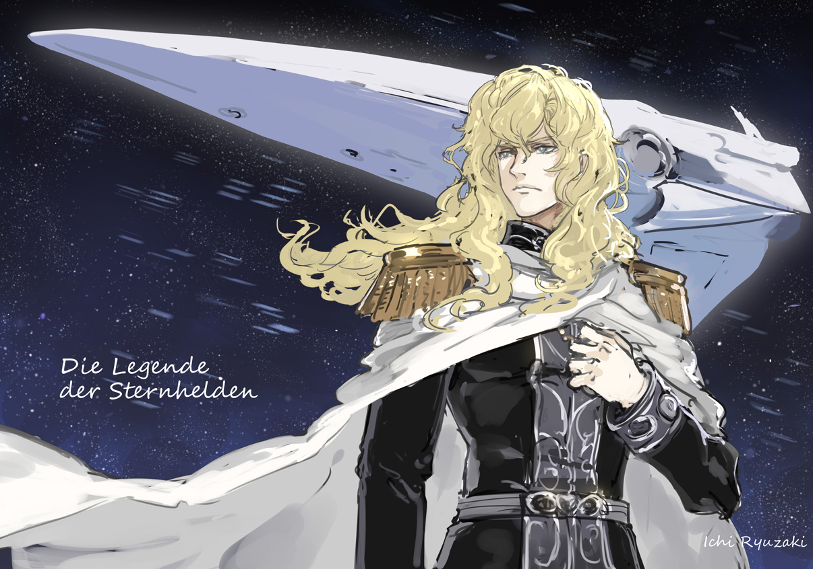
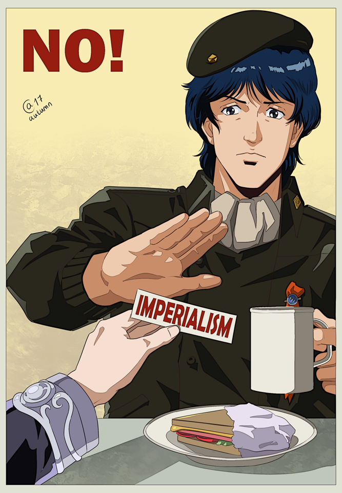
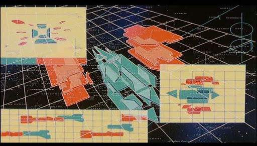

import video1 from './video1.mp4';
import video2 from './video2.mp4';

# Introducción
Hablar de The Legend of the Galactic Heroes (LOGH) es referirse a la Space Opera –bélica- por antonomasia. Monumental, ambiciosa, una rareza en la historia del anime que no se va a volver a repetir en la vida.

Nacida como una serie de novelas de ciencia ficción escritas por **Yoshiki Tanaka** e ilustradas por **Naoyuki Kato** (del primer al quinto volumen) y **Yukihisa Kamoshita** (del sexto al último volumen). Dichas novelas se adaptaron al anime, el cual duró desde 1988 hasta 2000 (la friolera de 12 añitos na más) del cual será del que hablaremos aquí. Pero no conformes con la serie y las novelas  hay un manga basado en las novelas, con el dibujo de **Katsumi Michinara**. 

La serie, al igual que las novelas o el manga, nos presenta un escenario en el que la humanidad, dividida en dos superpotencias: El Imperio Galáctico, una dictadura que recuerda mucho al Reino de Prusia y la Alianza de planetas Libres, una democracia podrida de corrupción y muy burocratizada; se ha expandido por la galaxia dejando atrás, incluso olvidando, la Tierra.

La trama nos plantea, explicado de forma muy burda para introducir con el mínimo de spoiler, una guerra entre estos dos bandos, por controlar la galaxia y llevar la libertad a los oprimidos y una pregunta que retumbará durante los 110 capítulos:

**¿Es mejor una buena dictadura que un mala democracia?**

Con esa simple premisa, estamos frente a una serie compleja y, algo que a mí me costó mucho y me dejó impactado en ciertos momentos, uno de los mejores dramas bélicos jamás creados.

# Actores del conflicto
En _La Leyenda de los Héroes de la Galaxia_, la trama se desarrolla en un universo complejo y dividido en múltiples facciones con ideologías, ambiciones y métodos muy distintos. Aunque es verdad que los dos bandos principales son El imperio y la Alianza, no es justo no pararnos a darle la importancia que se merece al Dominio de Fezzan y a la Iglesia de Terra, pues mucho depende de ellos. Cada uno representa una forma de gobierno, ideología o poder que se explora en profundidad, revelando las complejidades y paradojas de sus sistemas y antes de hablar de la trama tenemos que entender que mueve a cada actor del conflicto que presenta esta space opera.
### Imperio Galactico
Arquetipo tipico de Dictadura medieval o monarquia absolutista donde muy pocos tienen el poder y donde este se consigue por linage o por meritos militares. A lo largo de la serie y a través del personaje de **Reinhard von Lohengramm**, es el ejemplo de que una dictadura refleja la voluntad de su lider.

### Alianza de planetas Libres
A diferencia del Imperio, la Alianza es una democracia, aunque plagada de corrupción y manipulación política. Representa el ideal democrático y la libertad individual, pero al mismo tiempo muestra cómo este sistema puede ser ineficaz frente a la ambición y el egoísmo de algunos de sus líderes. A través del personaje de **Yang Wen-li**, se explora la vulnerabilidad de la democracia cuando no está respaldada por sus ciudadanos y esta repleta de líderes que no defienden sus valores fundamentales.

### Dominio Fezzan
Fezzan es un planeta enclave comercial neutral, gobernado por una oligarquía que utiliza la economía y la diplomacia como armas para manipular y mantener su influencia sobre el Imperio y la Alianza y ganar poder a costa del conflicto. A lo largo de la serie representa el poder del dinero en la política, resalta cómo los intereses económicos pueden ser una herramienta de control igual de poderosa, si no más, que el poder militar. Fezzan una amenaza, mas que un recordatorio de cómo los intereses económicos pueden prevalecer y manipular tanto en democracias como en autocracias, y de cómo el dinero puede ser una cadena más que subyuga a los pueblos.
### Iglesia de Terra
Este grupo religioso planea, desde las sombras, restaurar la hegemonía de la Tierra sobre toda la galaxia. La Iglesia de Terra representa el poder de la fe como una fuerza manipuladora. La religión, a lo largo de la serie, se convierte en un mecanismo de dominación que explota las esperanzas de las personas y su necesidad de algo en qué creer, usándolos para intereses políticos y afectando a los planes de los tres bloques.

# Reseña
Hecha ya la intro y presentados ya los Actores principales, no os pienso contar nada mas, aqui he venido a hablar de mi mas sincera opinion sobre todo lo que nos presenta esta serie, los logros que para mi consigue y porque creo que tienes que invertir el tiempo en disfrutar de esta historia.

Quiero empezar por nno de los grandes logros de LOGH y es la capacidad de mostrar la realidad política y la guerra en términos realistas y crudos. La política aquí no es algo que está flotando en el aire, sino que al igual que en la vida real, es algo que cruza transversalmente todo. Aquí la guerra no es una cuestión de buenos y malos. Los que mueren no son orcos o alienígenas diferentes a nosotros que encarnan el mal. No. quienes mueren son personas. Lo magistral planteado de la ambigüedad moral y la ausencia de héroes. Si bien es cierto que en la serie podemos encontrar personajes malos, despreciables y detestables, lo cierto es que no nos encontraremos con villanos y, mucho menos, nos hallaremos con héroes. **Yang Wen-Li, Julián Mintz, Reunthal y Reinhard** son tan humanos como cualquiera y como eso pueden tener una muerte injusta (tanto que llegué un momento a llorar y deprimirme con el destino de algunos personajes).

Otra cosa increible que tiene la serie es que sabe lo que es, es un drama politico y militar y como tal una parte fundamental de esta es la estrategia y la politica, siendo uno de los pilares narrativos de la serie es el uso de estrategias militares como herramienta para reflejar la genialidad y la ética de sus protagonistas. Las batallas en _La Leyenda de los Héroes de la Galaxia_ no son solo enfrentamientos de fuerza bruta, ni espectáculos de epicidad audiovisual, son confrontaciones intelectuales donde se pone a prueba el ingenio y la moralidad de sus líderes. **Yang Wen-li,** por ejemplo, emplea tácticas defensivas y procura minimizar las bajas en combate muchas veces prefiriendo una retirada, lo cual demuestra su compromiso con la vida y la paz y la lenta tarea que esta representa. **Reinhard**, en cambio, suele preferir estrategias ofensivas y contundentes, muchas veces obviando el costo de vidas, reflejando su ambición, deseo de control absoluto y la necesidad de conseguirlo todo para poder disfrutarlo mientras siga vivo.

Las estrategias militares funcionan, además, como un espejo de las filosofías y valores de los personajes. Los dilemas tácticos de los protagonistas en el campo de batalla se alinean con los dilemas éticos y políticos que enfrentan fuera de él, creando un paralelo entre la guerra y la política. A través de estas estrategias y los dialogos que se muestran mientras se plantean estas, la serie cuestiona sobre si es posible lograr fines éticos a través de medios violentos y si un líder tiene el derecho de sacrificar vidas por el bien mayor.

La narrativa explora temas de ideología política, ética y el sentido de la justicia. La serie plantea preguntas profundas sobre el papel del liderazgo y la gobernanza. A través del contraste entre la autocracia del Imperio y la democracia de la Alianza, el anime examina las fortalezas y debilidades de ambos sistemas.

Uno de los dilemas principales es si la paz y la estabilidad deben imponerse a través del poder absoluto o lograrse mediante el consenso y la libertad individual. Mientras Reinhard cree en una paz duradera bajo un gobierno fuerte y centralizado, Yang Wen-li defiende la libertad, aunque reconoce que la democracia es imperfecta y vulnerable a la corrupción y la manipulación:

<video src={video1}  controls></video>
Por ultimo, una de las cosas más interesante de LOGH aparte del planteamiento que hace sobre la guerra y la política, y como la misma afecta la vida de los ciudadanos de a pie, es: **¿Cuál es el mejor sistema político?** **¿Cuál es la mejor forma de gobierno?** Como he comentado en la introducción, esta es una pregunta se mantiene en el fondo de todos los arcos de la serie. Será una duda que **Yang Wen-Li** traspasara a **Julián Mintz** tendrá durante toda la serie. Y que, en cierto momento otros personajes se plantearan tal y como hemos visto en el video anterior. 
También habrán otras dudas filosóficas profundas, como el papel del honor, la lealtad, la búsqueda de la gloria, pero ninguna de ella opacara las planteadas. Lo que nos lleva a preguntar **¿Por qué es tan importante determinar cuál es la mejor forma de gobierno?**  La primera razón es porque se están perdiendo vidas por ello. Y toda vida es valiosa, así que debe haber una buena razón.

<video src={video2} controls></video>

Yang Wen-Li, por ejemplo, dirá que muchas veces gobiernos autoritarios suelen dar más libertades a su gente, especialmente si son nuevos, y dar pie para grandes cambios sociales, económicos y políticos de forma más efectivo, que gobiernos democráticos. En gran medida, se debe a que los autoritarios puede coaccionar a la ciudadanía y a las élites a cumplir con las nuevas políticas. Y bueno, porque se saltan la fase de deliberación.

Yang Wen-Li no tendrá una respuesta para Julián, y por lo tanto para nosotros como espectadores, pero si dirá algo. Y esto es lo más bello e interesante de la serie: 

**Uno debe apegarse a sus principios y valores. Defenderlos todo lo que sea posible.**

El dilema final que plantea la serie es si la humanidad, con todas sus imperfecciones y conflictos, puede crear una paz duradera sin ser prisionera de sus ambiciones y temores. _La Leyenda de los Héroes de la Galaxia_ no ofrece una respuesta clara, pero a través de sus personajes y su análisis profundo de la política y la moralidad, nos invita a reflexionar sobre la condición humana y el precio de la paz.

En última instancia, _La Leyenda de los Héroes de la Galaxia_ es una epopeya que va más allá del entretenimiento, nos invita a cuestionar y reflexionar sobre la naturaleza humana y la política. Con una narrativa madura y un desarrollo profundo de personajes, el anime establece un diálogo sobre temas eternernamente actuales como el poder, la justicia y la libertad. 

Esta es una obra que, sin duda, me ha dejado una huella duradera y quienes la ven opinan similar, no solo por su historia de guerras y estrategias, sino por su incisiva reflexión sobre lo que significa ser humano en medio de conflictos y ambiciones galácticas.

Me despido y espero que no se haya sido muy aburrido o caótico leerme. Os dejo, como siempre con algo de música pero esta vez con la una de las mejores canciones de la BSO del remake de Netlfix de esta serie (que no tiene mucho que ver con todo lo que os he contado, se centra mas en las peleas y poco o nada en lo político o filosófico pero la bso es muy buena)

<iframe style="border-radius:12px" src="https://open.spotify.com/embed/track/44UgawdeYuvQ1rKc33t2tp?utm_source=generator" width="100%" height="152" frameBorder="0" allowfullscreen="" allow="autoplay; clipboard-write; encrypted-media; fullscreen; picture-in-picture" loading="lazy"></iframe>
