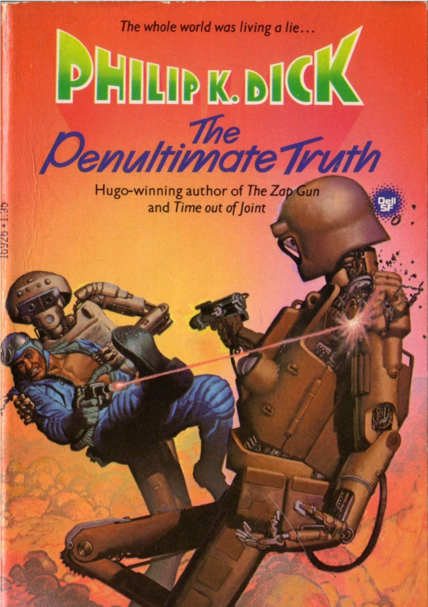

# Introducción

Hace ya unas semanas, casi un mes, que no escribo por aquí, muchos cambios, muchas cosas han pasado, pero aquí estamos de nuevo y como mi as bajo la manga para cuando me quedo sin ideas, vamos a hablar de Philip K. Dick y del ultimo libro que me he leido de este prolifico autor pero sobretodo del peso de esta obra a dia de hoy y del escenario en el que se concibio.

Quiero avisar que, como de costumbre, esta reseña no tendrá spoilers importantes pero si de los primeros capítulos (necesario para explicar la magnitud de este libro)

## La "penúltima" verdad como una mentira más

Corre el año 2025 y una guerra azota la superficie de la tierra desde hace mas de 13 años. La tercera guerra mundial enfrenta a occidente (la Pac-Peop) y la coalición soviética (Bloc-Peop). O eso, como lectores es lo que la sinopsis de esta obra es lo que nos vende.

Bajo metros de roca y tierra, miles de millones de personas viven en bunkers, temerosos de la guerra nuclear y llamados a ser la maquinaria bélica necesaria para construir los robots que se enfrentan al bando contrario. 

De una a tres veces al día Talbot Yancy, el gran protector, sale en las noticias del bunker para decirles a la humanidad el estado de la guerra la cual están perdiendo contra la coalición soviética.

Nicholas Saint James es el presidente electo del Tom Nix, uno de estos bunkers dedicados a la construcción de robots, y que no podrá cumplir la cuota este mes pues su mecánico jefe esta a punto de sufrir un fallo hepático. Nicholas Saint-James se verá obligado a  salir  a  la  superficie para encontrar un páncreas artificial, con el que poder salvar su vida.

Con todo esto ya tendríamos una trama para un muy buen libro, pero estamos hablando de Philip K. Dick, no de un escritor corriente. Corre el año 2025, y lo que no saben los obreros, el gran orgullo de la nación y la maquinaria que el gran protector Talbot Yancy anima a que produzcan y formen parte del esfuerzo compartido, es que la guerra terminó hace trece años y la Tierra ahora es una inmenso jardín en donde viven los poderosos en sus grandes fincas y rodeados de su séquito de robots.

Fuera conocemos a muchos personajes, pero nos centraremos en dos, para no avanzar demasiado y hacer spoiler.

Stanton Brose, el dirigente máximo de la Tierra, un octogenario repugnante y maquiavélico que lidera a los hombres de Yance, la organización que nutre de discursos, videos y noticias falsas al simulacro de Talbot Yancy en las televisiones de los ciudadanos de los bunkers.

Joseph Adams, uno de los mejores Hombres de Yance y redactor de discursos para el simulacro del protector, el cual se encuentra con un bloqueo escritor, ahogado entre un mar de dudas y acosado siempre por el sentimiento de culpabilidad de lo que le están haciendo a la humanidad.

A lo largo de la historia nos encontraremos a mas personajes: David Lantano, Luis Runcible o Webster Foot; pero si queréis saber mas de ellos tendréis que leer el libro, para lo que quiero contar con estos tres personajes nos sobra.
## Reseña
En el escenario tenemos tres actores, el engañado, el que crea la verdad y el que trasmite esa verdad pero se arrepiente. Esto genera básicamente los tres puntos de vista que se desarrollaran a lo largo de toda la novela y nos presenta un mundo claro, el mas claro de toda la carrera de Dick diría yo, una gran mentira urdida por los poderosos en su provecho y que condena a la mayor parte de la humanidad a llevar una existencia precaria y en condiciones infrahumanas.

Ya para cuando se publicó, en 1964, el libro ya poseía un peso muy significativo y aunque los agentes de los que se inspira (los bloques americano y soviético en la guerra fría) ya han quedado un poco atrás, el temor a la guerra, la propaganda y la manipulación mediática están mas presentes que nunca en 2024.

La novela nos habla de la manipulación masiva a través de la narrativa del sentimiento patrio, muy influenciado por la propaganda y la desinformación que Dick veía a su alrededor, y también se adentra en temas como la alienación, la lucha de clases y la tecnología como herramienta de control, todas preocupaciones que resonaban con su experiencia de un mundo que se sentía cada vez más opresivo e incierto.

El clima político y sus experiencias personales profundizaron la paranoia de Dick y alimentaron su obsesión por la vigilancia y las conspiraciones, temas recurrentes en sus obras. En novelas como la que estamos reseñando, Radio libre Albemut y _Fluyan mis lágrimas, dijo el policía_, se percibe una preocupación persistente por los límites entre realidad, la manipulación, así como por el control de las autoridades sobre la vida de los ciudadanos.

Pero el denominador común en prácticamente todas estas novelas es el personaje que descubre que lo que ha considerado hasta ese momento como la realidad es en verdad una ilusión, una mentira, una falsedad. Con esta idea Nicholas Saint James, Joseph Adams, Stanton Brose y todos los demás personajes se embarcan en una historia (aunque floja en alguna ocasión), con bastantes giros inesperados y sabiendo mantener el interés hasta la ultima de las paginas.

## Conclusión

Quiero confesar que no ha sido de mis novelas preferidas de Dick, pero me ha gustado mucho. Este libro representa las inquietudes de su tiempo de una manera magistral y a un nivel más profundo, el título se refiere a la naturaleza de la realidad y cómo los seres humanos la perciben. ¿Es posible alcanzar la verdad absoluta o siempre estamos atrapados en un nivel de percepción subjetivo e incompleto? La penúltima verdad nos muestra esa capa de la realidad que se presenta como definitiva, pero que en verdad es una construcción manipulada, instándonos a que siempre puede haber algo más allá: la verdad final.

<iframe style="border-radius:12px" src="https://open.spotify.com/embed/track/2K1ENoIs1y6M5nFdJhLpvU?utm_source=generator" width="100%" height="152" frameBorder="0" allowfullscreen="" allow="autoplay; clipboard-write; encrypted-media; fullscreen; picture-in-picture" loading="lazy"></iframe>

